下载research report.pdf可以获得更好的阅读体验。

# 一、主要内容

## 概要

​		作者认为**内存中键值存储（In-memory key-value stores）**的热点问题被忽视了，并提出了一种名为**HotRing**的**热点可感知的KV数据结构**，它具有以下的特性：

+ 基于**有序环哈希索引结构**，通过让**头节点更靠近热点数据**来提高热点数据的访问速度
+ 提供**轻量**、**运行时**的**热点转移检测策略**
+ 支持**并发**且**无锁**

## 1介绍

​		互联网公司在实际生产环境中**广泛应用内存中键值存储**来提高数据存储的性能。学者们**研究了不同场景下的热点问题**，并且在一些场景中提出了有效的解决方案。然而，**内存中键值存储场景下的热点问题被忽略**了，但这个问题在互联网时代的变得空前重要。目前很多数据结构实现的**KVS都不能感知热点项目**，基于哈希表的KVS如果希望能提高热点项目的访问性能，会造成很大的开销。所以作者提出了**基于有序环哈希索引结构的热点可感知KV数据结构**HotRing。

## 2背景与动机

### 2.1哈希索引与热点问题

​		在KVS中，哈希索引是最常用的结构，一般哈希索引包含一个哈希表和一个**冲突链**。

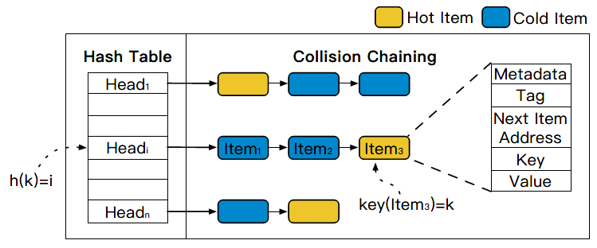

​		哈希索引无法感知热点项目，所以热点项目是平均地分布在冲突链中，在工作负载高度倾斜的情况下，这种分布会导致整体性能的严重下降。

​		针对热点问题，目前有两种解决办法：

+ 使用CPU cache存储热点项目，但cache容量很小，只能存储全部容量的0.012%。
+ rehash，但会成倍地增加内存消耗，而性能提升有限，不划算。

### 2.2理论证明热点感知的好处

​		通过公式：
$$
E_{chain}=1+\frac{L}{2}=1+\frac{N}{2\cdot{B}}\tag{1}
$$

$$
L:链长度\ N:总项目数\ B:总桶数\ E_{chain}:冲突链表访问内存的预期次数
$$

​	
$$
f(x)=\frac{\frac{1}{x^\theta}}{\sum_{n=1}^N\frac{1}{n^\theta}}\tag{2}
$$

$$
θ:偏度因子\ N:总项目数\ x:第x个热点项目\ f(x):第x个热点项目出现的频率
$$

$$
\begin{equation}\begin{split} 
E_{ideal}&=1+\sum_{k=1}^LF(k)\cdot{k}\\
		 &=1+\sum_{k=1}^L[\sum_{i=(k-1)\cdot{B}+1}^{k\cdot{B}}f(i)]\cdot{k}
\end{split}\end{equation} \tag{3}
$$

$$
F(k):每个链上项目的累计访问频率\ E_{ideal}:冲突链表访问内存的预期次数
$$

​		证明了采取热点感知的数据结构的性能提升，代码验证详见`formula1.cpp`, `formula2.cpp`, `formula3.cpp`。

### 2.3挑战与设计原则

​		在设计解决方案时，需要满足以下两个条件：

+ 需要轻量级的热点感知策略，并且底层数据结构要支持热点转移
  + 将冲突链表改成环，以支持热点转移且可以访问到所有项目

+ 需要支持大规模并发
  + 采用无锁结构实现删除和插入操作
  + 实现热点移动检测，头部指针移动和重新哈希等基础操作

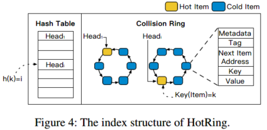

## 3HotRing设计

### 3.1有序环

​		作者对于有序环的设计满足以下三个条件：

①将冲突链表首尾相接，变成环

②哈希表中的头指针可以指向环中任意项 

③环中各项有序排列  

​		这种设计便于以任意节点作为遍历操作的首项，都可以遍历全部的项目，便于感知到热点项目后，将头指针指向热点项目。但由于并发访问有可能改变哈希表中头指针指向的项目（比如头指针指向的项目被删除），所以仅仅将头指针指向作为搜索停止条件是不够的，因此作者设计了环中节点的排序规则并制定了搜索停止条件。

排序规则：
$$
order_k=(tag_k,key_k)
$$
搜索命中条件：
$$
order_i=order_k\tag{4}
$$
搜索未命中（终止）条件：

原文公式：
$$
\left \{
\begin{array}{}
order_{i-1}<order_{k}<order_{i}(搜索项位于环中两项之间)\\
order_{k}<order_{i}<order_{i-1}(搜索项位于环中最小项的前面)\\
order_{i}<order_{i-1}<order_{k}(搜索项位于环中最大项的后面)
\end{array}
\right.\tag{5}
$$
注意：假设$order_{i-1}$ 指向$ order_i$ ，那么 $order_i$ < $order_{i-1}$时，$order_i$为第一项 $order_{i-1}$为最后一项

举个例子：

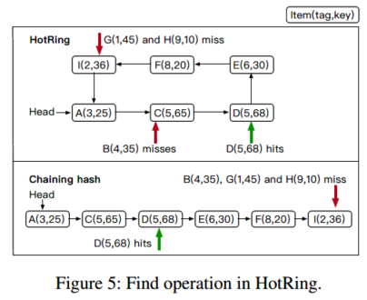

+ 项目B满足搜索终止条件1，搜索项位于环中两项之间，未命中
+ 项目D满足搜索命中条件，命中
+ 项目G满足搜索终止条件2，搜索项位于环中最小项之前，未命中
+ 项目H满足搜索终止条件3，搜索项位于环中最大项之后，未命中

### 3.2热点转移识别

#### 3.2.1随机移动

##### 描述

​		将头指针定期移动到潜在热点，不需要记录任何历史元数据就可以决定。

###### 热点调整

+   当一个线程执行R次请求后，进行一次热点转移
+   移动头指针
    +   若头指针已经热点项目，那么不需要移动头指针
    +   否则，移动头指针到本次请求的项上

##### 优点

+   实现简单，执行策略的开销小

##### 缺点

+   当环中存在多个热点项目时，只能处理一个热点项目
+   可能会产生头节点的频繁移动，导致该策略会非常低效
    +   工作负载倾斜较小
    +   选择的周期R较小

#### 3.2.2统计采样

##### 描述

​		定期发起一次是否需要统计采样的判断，若需要采样，则以接下来环长度个访问作为样本，通过公式统计计算出新的热点位置；否则，不做操作。

###### 索引格式

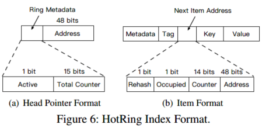

头指针`head`格式：

+   `active`：1 bit，控制统计采样的标识
+   `total_counter`：15 bits，统计采样时环总访问次数
+   `address`：48 bits，环中某项的地址

环上`next`指针格式：

-   `rehash`：1 bit，控制rehash的标识
-   `occupied`：1 bit，控制并发，保证并发访问的正确性
-   `counter`：14 bits，某一项的具体访问次数
-   `address`：48 bits，后一项的地址

###### 统计采样

+   当一个线程执行R次请求后，进行一次热点转移

+   移动头指针
    +   若头指针已经热点项目，那么不需要移动头指针
    +   否则，开启统计采样，采集环长度个样本，根据采样结果，移动头指针
        +   `head.active`置位
        +   统计接下来环长度个访问，对每项的访问次数与总访问次数进行计数

###### 热点调整

+   在统计采样中，最后一个进行访问线程负责计算频率计算和热点调整
    +   关闭`head.active`
    +   遍历环，计算每一项的访问频率$\frac{n_k}{N}$
    +   根据公式6计算头指针指向每一项时$W_t$，将$W_t$最小的一项t作为新的热点项目
    +   若热点项目不同，则使用CAS操作设置头指针
    +   重置所有计数器

$$
W_t=\sum_{i=1}^{k}\frac{n_i}{N}\times[(i-t)modk] \tag{6}
$$

$$
W_t：头指针指向第t项时环平均内存访问次数\ N:总访问次数\ n_i:第i项的访问次数\ k：环的长度
$$

###### RCU写入密集型热点

​		当进行大量修改操作时，需要使用RCU协议来保证性能，HotRing采用了这一协议。RCU是指read-copy-update，读-拷贝修改。当进行这RCU操作时，需要修改前一项的`next`指针，因此需要遍历整个环来取得被操作项的前一项。这就导致若对某项进行频繁的RCU操作，也会导致该被操作项的前一项访问频繁，而且每次伴随着开销较大的遍历操作。基于此，当进行RCU操作时，会把统计采样的访问次数加到被操作项的前一项上。

​		同时，当发生小于8字节的修改时，HotRing提供了原地更新算法。

###### 热点继承

​		当对头节点执行更新或删除时，需要一种机制来保证头节点尽量指向一个hot item，来保证性能。

-   若环只有一项，直接通过CAS更新头指针即可
-   若环有多个项，利用已有的热点信息（即头指针的位置）处理：
    -   RCU更新：指向新版本的头（因为很可能会被再次访问，比如读取）
    -   删除：指向被删除项的下一个节点

##### 优点

+   适用于环中存在多个热点项目的情景
+   选出的hot item可以提供更可靠

##### 缺点

+   实现相对复杂，采样统计开销比较大

### 3.3并发操作

​		头指针的移动导致了并发操作的两个问题：

-   头指针移动和其它操作并发，需要检查指针的有效性
-   更新或删除时，需要检查头指针是否指向被删除项，并正确地更改头指针

#### 读取

+   不需要额外操作，过程完成无锁。

#### 插入/更新/删除的问题：

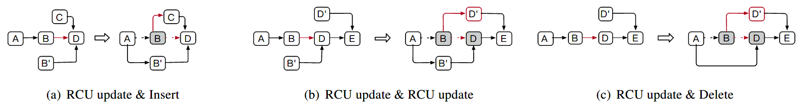

a）：一线程通过RCU更新B项，同时另一线程需要在BD之间插入C。若不做处理，则两个操作都会成功，最终导致旧B项指向了C项，因此造成C项丢失。所以，RCU更新操作前需要将旧B项的`occupied`设置为占用；插入操作前检查需要修改的`next`指针是否被占用，保证插入操作检测到被占用，从而进行重试。

b）：一线程通过RCU更新B项，同时另一线程通过RCU更新D项。若不做处理，则两个操作都会成功，最终导致旧B项指向了D‘，B'项指向了旧D项。解决方法如a)

c）：一线程进行删除B项操作，同时另一线程通过RCU操作更新D项。若不做处理，则两个操作都会成功，最终导致旧B项指向了D‘，A项指向了旧D项。所以，删除操作前，需要把删除项的`occupied`设置为占用，更新操作解决方法如a）。保证另一线程的RCU更新操作失败，并重新尝试操作。

#### 插入

+   创建新项
+   连接新项的`next`指针
+   检查前一项的`next`指针是否被占用
    +   若没有，则通过CAS修改前一项的`next`指针
    +   若被占用，则重新尝试两步

#### 更新

当更新的数据不超过8字节：使用in-place CAS，不需要其它操作。

当更新的数据超过8字节：使用RCU更新：

+   设置旧项的`occupied`为占用
+   再更改前一项的`next`指针

#### 删除

+   设置被删除项的`occupied`为占用
+   再更改前一项的`next`指针

#### 头指针移动

+   正常的头指针移动
    +   设置新指向的项目的`occupied`为占用
+   更新/删除头指针指向的项目
    +   更新时，需要将旧版本项目的`occupied`为占用
    +   删除时，需要将被删除项目和被删除项目的下一项的`occupied`为占用

### 3.4无锁rehash

​		HotRing支持无锁rehash操作。而和其它使用负载因子来触发rehash不同，HotRing使用访问开销（即操作平均内存访问次数）来触发rehash。整个rehash操作分为初始化，分割，删除三步。

#### 初始化

​		rehash线程初始化一个2倍大小的哈希表，原表中的每个环都将被拆成两个环。rehash操作中，哈希值用于定位的部分从k位变成了k+1，tag则减少了1位，因此根据tag的值分成[0, T/2)和[T/2, T)两个部分。

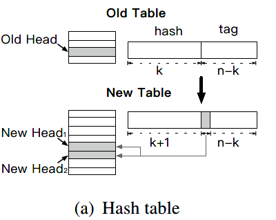

​		rehash线程会创建一个`rehash node`，其中包含两个`rehash child item`，这两个`item`不包含KV结构，`tag`分别为0和T/2，并用rehash标志来标识。它们将作为拆分后两个环的头节点。

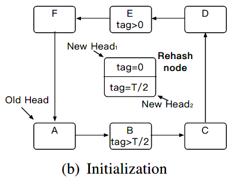

#### 分割

​		rehash线程将`rehash node`中的两个`rehash child item`插入到环中，此时新表被激活，后续的访问可以通过新表进行，而过去旧表的访问也依然可以继续进行。

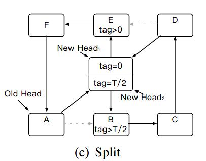

#### 删除

​		保持一段过渡期，所有针对旧表的访问结束后，rehash线程删除`rehash nodes`，将环真正拆成两个新环。

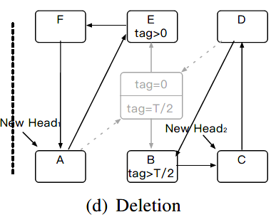

# 二、主要贡献

+ 作者证实了现有**内存索引中的热点问题**，并证明了**热点感知设计**具有极大提高热点项目的性能的潜力。
+ 作者提出了有序环哈希结构**HotRing**，它的主要贡献如下：
  + **HotRing**通过将头指针移近热点项目，来快速访问热点项目。
  + **HotRing**采用轻量级策略在运行时检测热点转移。
  + **HotRing**是利用热点感知进行设计的第一次努力。
+ 作者通过无锁设计令**HotRing**支持高并发访问，并设计了针对**HotRing**的特定操作：
  + 热点移位检测
  + 头部指针移动
  + 有序环重新哈希
+ 作者基于实际工作量基准的方法评估**HotRing**的性能，结果表明：当访问高度不对称时，**HotRing**的性能明显优于其他KVS。

# 三、论文的长处和短处

## 长处

### 通过较小的改动实现了性能的大幅提升

​		作者仅通过将哈希索引结构中的冲突链表结构修改成环结构，既不影响原有的查找功能，又可以在此基础上增加热点转移功能。这提醒我在今后的研究中，可以寻找系统中未达成最优结构的小组件来进行优化，进而提高系统的整体性能。

### Rehash操作保证了系统并发性能的稳定

​		作者将Rehash操作分成Initialization，Split，Deletion三步：

+   第一步仅仅申请新哈希表与创建Rehash Node, 并将新表中的头指针指向Rehash Node中相应的Rehash Item，这个过程中不会影响系统的其他操作；
+   第二步将Rehash Node中两个Rehash Item插入到旧的环中，这个操作相当于在环结构中进行了两次插入操作，不会影响其他正在进行的操作。当操作完成后，针对旧哈希表的访问不会受到影响，同时，新哈希表也可以开始工作。
+   第三步，等待针对旧哈希表的请求全部结束后（这个期间仅仅阻塞rehash线程，其他线程不受影响），将执行删除Rehash Node的操作，这个过程基本相当于执行了两次删除节点操作，并重新指定头节点。

​		综上，在Rehash过程中，不存在一个时间点（段）需要拒绝所有请求，这保证了系统性能的稳定可靠。而且作者用较小的开销就实现了Rehash功能，非常值得学习。

### 研究方向新颖

​		论文基于实际工业环境下工作负载高度不平衡的问题，发现目前主流的KVSes针对内存中的热点问题没有高效的解决方案。本文揭示了该问题对目前工作的严重影响。

### 研究逻辑缜密

​		论文主体结构为:

+   发现问题->

+   证明问题严重性->

+   提出可能的解决方案->

+   实现解决方案->

+   证明解决方案的有效性

    研究逻辑缜密，研究过程层层递进，结果令人信服。

### 解决方案具备参考价值

​		论文中提出，在互联网时代，社会热点问题会在较短时间内被大量访问。并且社会热点会随着时间转移。所以，具备**热点感知**能力的存储系统有比较好的发展潜力，只给未来相关领域的研究提供了新的解决思路。

## 短处

### Rehash操作中激活新表描述的不清楚

​		根据原文，Rehash操作在插入Rehash Item后，新表被激活，此时来自新表的访问通过比较tag来选择头节点，来自旧表的访问通过识别Rehash Node继续执行。

+   前半句：当新表产生后，可以直接通过计算哈希值来确定New Head，而此处说新表需要通过比较tag来确定新的头节点，表述有些模糊。

+   后半句：结合前文所述，结构采用比较order的方式来确定项目，其中$order_k=(tag_k,key_k)$ ，此处所表达的意思可能是：通过识别Rehash Node确保不会产生比较错误。

​		如果此处能结合示意图进行举例说明，可以更清楚地表达作者的想法。

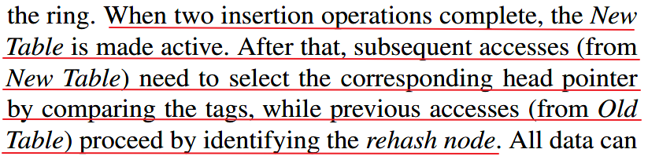

### 在测试部分介绍YCSB工作负载时，描述不够直观

​		在文中只对ABCDF的工作负载情况进行了文字介绍。如果可以把每种工作负载的情况绘制成表格形式，那么可以有利于读者更直观地了解工作负载的配置情况与比较不同工作负载情况下的性能表现。

### 研究视角有局限

​		论文核心问题是在工作负载高度不平衡的环境下提出的，研究视角主要聚焦于实际生产环境中产生的问题。作者在测试部分着重比较了在工作负载不平衡的情况下各种KVSes的比较，还可以分析比较一下工作负载相对平衡的环境下的性能表现。

# 四、收获

## 专业知识方面

### CAS

​		CAS指Compare and Swap，其思想是利用三个参数：一个当前内存值V，旧的预期值A，即将更新的值B实现一种无锁且保证线程安全的机制。它的操作过程如下：

+   线程拷贝需要修改的内存中的值保存为A
+   线程得到即将更新的新值为B
+   线程读取需要修改的内存中的当前值V，比较V和A是否相等
    +   相等，说明该值没有被其他线程改动，将内存中的值改为新值，修改成功
    +   不相等，说明该值已经被别线程改动过，修改失败

​		比较修改操作需要保证是原子操作，一般是由CMPXCHG的汇编指令来实现，上层应用也可以通过加锁操作等来保证。（不过这丧失了无锁化的初衷）

​		ABA问题指在进行CAS操作时，内存中的值由A改成B又被改回A，而CAS线程只保存了第一个版本的内存值A，并不知道内存值已经被变动过。ABA问题一般可以通过给变量增加版本号来解决，将A->B->A的过程变成A1->B2->A3，那么进行CAS操作时既时发生ABA问题，线程也会察觉到，并保证不会进行修改操作。

### RCU

​		RCU是指Read-Copy-Update，是一种针对读取请求多，修改请求少环境下的锁结构，它的操作过程如下：

+   读取线程不需要获得任何锁就可以访问数据
+   修改线程在访问它时首先拷贝一个副本
    +   然后对副本进行修改
    +   当其他线程都退出对数据的操作后，再将原来数据的指针指向修改后的新数据
    +   释放存储旧数据的空间

​		使用RCU机制时，读取线程不需要获取锁资源，所以在读取请求较多时，使用RCU可以有效提高系统性能。但RCU需要其他的锁机制来实现修改线程间的同步，并且修改线程还需要复制数据内容，延迟释放空间等。所以当修改频繁时，RCU机制的性能不是很好。

### HotRing数据结构

​		HotRing是一种具备热点感知能力的有序环哈希结构，它大大改善了工作负载高度不平衡环境下的存储系统性能。

## 研究常识方面

### 工作负载不平衡

​		认识到工业界实际工作负载非常不平衡，一般状况下，超过一半（57.3%）的访问请求只会访问1%左右的数据，而极端状况下，超过九成（91.7%）的访问请求只会访问1%左右的数据。所以**热点问题**在各种存储系统中都是一个非常严重的性能瓶颈。

### 热点问题分布广泛

​		在存储领域，热点问题分布非常广泛。来到互联网时代后，热点问题更加严重，当一个社会热点事件出现时，大量的访问请求会集中在极少的数据上。

### 热点感知方案具有潜力

​		具备热点感知能力的存储系统可以更好的应对当前的互联网环境，同时，热点感知在处理**热点问题**上有很好的潜力，可以尝试应用在其他场景下。

# 五、论文存疑的地方

## 疑问1

​		在论文中，Rehash操作的第三步，Rehash线程会在过渡期等待所有针对旧哈希表的访问结束后开始分裂。并且，在过渡期中，HotRing仅仅阻塞了Rehash线程。但我考虑，这还不能保证Rehash操作的正确性。

​		Rehash操作中，如果存在针对新表的RCU操作，RCU线程若还未找到被更新项的前一项，旧环就被断开了，可能造成该RCU线程死循环。

# 六、实践

## 设计目标：

1.  根据论文思想，复现论文方法，设计编写符合HotRing思想的数据结构。
2.  通过对比实验，体现HotRing相比HashTable的优点。

## 测试指标：

| 指标                               | 说明                       |
| ---------------------------------- | -------------------------- |
| 总查找次数（findcnt）              | 反应系统完成任务的总开销   |
| 单次最高查找次数（maxFindcnt）     | 一定程度上反应系统的尾延迟 |
| 单次最低查找次数（minFindcnt）     | 反应系统单次查询的最优表现 |
| 平均单词查找次数（averageFindcnt） | 反应系统每次查询操作的     |
| 消耗的时间（useTime）              | 反应系统完成任务的总耗时   |

## 测试数据：

### 控制单一变量：theta

| 数据文件   | 总项数 | 总查询数   | 键桶比 | theta | 备注                   |
| ---------- | ------ | ---------- | ------ | ----- | ---------------------- |
| test1.data | 2000   | 10'000'000 | 2      | 0     | 工作负载分布完全平均   |
| test2.data | 2000   | 10'000'000 | 2      | 1     | 工作负载分布不平衡     |
| test3.data | 2000   | 10'000'000 | 2      | 2     | 工作负载分布极度不平衡 |

### 控制单一变量：键桶比

| 数据文件   | 总项数 | 总查询数   | 键桶比 | theta | 备注        |
| ---------- | ------ | ---------- | ------ | ----- | ----------- |
| test2.data | 2000   | 10'000'000 | 2      | 1     | 平均链长为2 |
| test4.data | 4000   | 10'000'000 | 4      | 1     | 平均链长为4 |
| test5.data | 8000   | 10'000'000 | 8      | 1     | 平均链长为8 |

## 测试结果：

| 数据文件   | 数据结构  | findcnt  | maxFindcnt | minFindcnt | averageFindcnt | useTime |
| ---------- | --------- | -------- | ---------- | ---------- | -------------- | ------- |
| test1.data | HashTable | 16538091 | 10         | 1          | 1.65381        | 76s     |
| test1.data | HotRing   | 16531911 | 9          | 1          | 1.65319        | 116s    |
| test2.data | HashTable | 22456351 | 6          | 1          | 2.24564        | 96s     |
| test2.data | HotRing   | 10816535 | 5          | 1          | 1.08165        | 84s     |
| test3.data | HashTable | 22009405 | 8          | 1          | 2.20094        | 93s     |
| test3.data | HotRing   | 10003612 | 7          | 1          | 1.00036        | 77s     |

| 数据文件   | 数据结构  | findcnt  | maxFindcnt | minFindcnt | averageFindcnt | useTime |
| ---------- | --------- | -------- | ---------- | ---------- | -------------- | ------- |
| test2.data | HashTable | 22456351 | 6          | 1          | 2.24564        | 96s     |
| test2.data | HotRing   | 10816535 | 5          | 1          | 1.08165        | 84s     |
| test4.data | HashTable | 23549070 | 8          | 1          | 2.35491        | 99s     |
| test4.data | HotRing   | 11057968 | 7          | 1          | 1.1058         | 83s     |
| test5.data | HashTable | 22783760 | 7          | 1          | 2.27838        | 96s     |
| test5.data | HotRing   | 10882926 | 6          | 1          | 1.08829        | 83s     |

## 测试评价

1.  从两组实验中findcnt指标与averageFindcnt可以明显看出：当工作负载相对平衡时，HotRing与HashTable的总查询次数没有明显差距；但在工作负载极度不平衡下，hotring的总查找此处远远低于HashTable，本次测试仅仅测试了$10^7$量级下的查询性能比较。当测试量级更大时，这种差距应该会更加明显。
2.  根据`test1.data`可知，由于HotRing的search操作需要更多的判断条件与处理，所以当查找次数差不多时，HotRing的时间开销是要大于HashTable的。（此处与HotRing功能的具体实现方式也有很大关系）
3.  根据键桶比这一组测试结果发现：随着键桶比的提升，对HashTable与HotRing的性能影响不是非常明显，与论文中的测试结果有明显差距，推测可能的原因是：测试数据的量级比较小（$10^3$级），干扰因素造成的影响较大，偶然性也比较大。
4.  通过maxFindcnt来反应尾延迟的效果很差，原因我认为有以下几点：

+   maxFindcnt只能反应最差的一次查询操作所需要的查询次数，所以偶然性非常大，单次异常数据会直接导致指标失效。
+   测试尾延迟更应该关注各次查询开销（本实验中为查找次数）的分布情况，单独一次操作产生的数据指标，意义不大。

5.  minFindcnt指标基本无用，在大规模数据测试下，单独一次操作产生的数据指标统计意义很小。

## 问题与解决：

### HotRing耗时远高于HashTable

原因：在编写HotRing的search函数时，调用了new与delete，导致开销很大，严重影响了HotRing的性能。

解决：在HotRing结构体内部定义了一个用于比较的htEntry，查询操作中直接对该变量赋值即可，避免频繁new与delete。

### 当键桶比变大时，HashTable的性能有明显改善，甚至略优于HotRing

原因：在随机数据程序中，取key值时，用于随机数取余的MOD值为项数的十倍，由于总项数扩大了，所以随机数取值范围也扩大了，这有可能对hashfunction有影响。

解决：将MOD值固定为20000。

## 测试截图：

test1.data：

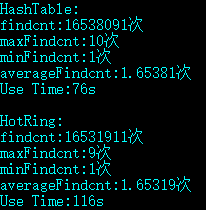

test2.data：

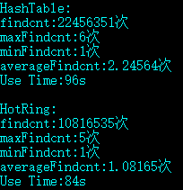

test3.data：

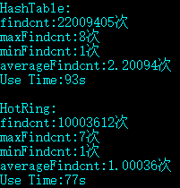

test4.data：

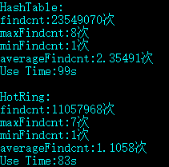

test5.data：

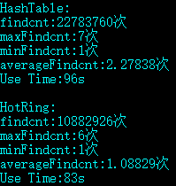

## 代码：

随机数据生成：`radomdata.cpp`

数据文件：`test1.data`, `test2.data`, `test3.data`, `test4.data`, `test5.data`

测试程序：`hotring-r.h`,  `hotring-r.cpp`,  `hashTable.cpp`, `main.cpp` 

# 七、未来研究设想

## 设计热点感知算法

​		作者在论文中提出了两种轻量级的热点感知算法，未来可以设计更多的热点感知算法来应对不同的应用场景，比如：

+   可以尝试设计热点感知算法来提前预测热点的来临

## 优化数据结构

​		可以在作者设计的HotRing结构基础上继续优化该数据结构，比如：

+   加入前向指针，令HotRing面对RCU操作，删除操作时，可以迅速确定前一项的位置，并且可以解决[疑问1](##疑问1)。

## 运用热点感知方案到其他场景

​		热点感知方案的核心思想是：**找到热点信息，将热点信息放在系统中可以较快访问到的位置。**那么，我们可以将统计采样策略移植到传统的关系型数据库中，或者移植到计算机内存与CPU之间，设计独立的模块，在CPU访问Cache之前，通过统计采样，为CPU提供可能需要被访问的数据。

# 参考

[keys961 Blog 论文阅读-HotRing: A Hotspot-Aware In-Memory Key-Value Store](https://keys961.github.io/2020/02/28/%E8%AE%BA%E6%96%87%E9%98%85%E8%AF%BB-HotRing-A-Hotspot-Aware-In-Memory-Key-Value-Store/)

[Glitter试做一号机 HotRing: A Hotspot-Aware In-Memory Key-Value Store](https://www.jianshu.com/p/0777755969ab)

[FAST '20 - HotRing: A Hotspot-Aware In-Memory Key-Value Store讲解视频](https://www.youtube.com/watch?v=NUmcE9BDvVE)

[云栖社区 存储顶会FAST'20论文揭秘Tair创新性引擎](https://yq.aliyun.com/articles/746727?type=2)

[多核原子操作与CAS操作](https://www.zhihu.com/question/64915964/answer/225710737)

[RCU操作原理](https://www.ibm.com/developerworks/cn/linux/l-rcu/)

《C++ Primer 5th》

《Redis设计与实现》

